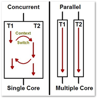

# KotlinGeometryExample

This project features code to support Fortezza Guild Night **Kotlin - 10 reasons why**.

## Same code in 2 languages
It contains 2 source root directories / packages directories, with obvious names:
* **Kotlin sources:** `nl.jhvh.kotlin` (`src/main/kotlin/nl/jhvh/kotlin`)
* **Java sources:** `nl.jhvh.java` (`src/main/java/nl/jhvh/java`)

The 2 packages have the same code, with the "same" code in Kotlin and in Java, respectively.

Spot the difference!

#### Conversions
Some classes / files contain conversions, e.g. from degrees to radians, or from feet to meters.
> *Of course one should **not** code such conversions yourself normally; instead use the stuff from
> the `javax.measure` for such requirements!*

This is just to show the use of *extension methods* and **`infix`** functions to my colleagues.
I will warn them not to do this! ;-)

## Tests
Like the source code, the tests are also divided in 2 separate root directories:
* **Kotlin tests:** `nl.jhvh.kotlin` (`src/test/kotlin/nl/jhvh/kotlin`)
    * These tests are also written in Kotlin
* **Java tests:** `nl.jhvh.java` (`src/test/java/nl/jhvh/java`)
    * These tests are written in Java.
      *At least, in the `main` branch! See below for more*.

### Mocking & assertions
##### Mocking
In the `main` branch, the tests use the typical mocking libraries that you expect for each language:
* **`Mockito`** for the Java tests
* **`mockk`** for the Kotlin tests

This allows you to get an idea of the differences between the two.
> Note that in order to make the Java classes testable by Mockito, the Java classes had to be changed:
> the delegate attributes had to be exposed (`protected` instead of `private`), and they had to be made non-final.
> See also the comments below on the `kotlin-tests-for-java-classes`-branch.

##### Assertions
For assertions, I personally prefer AssertJ to JUnit assertions (`org.junit.Assert`) and also to `kotlin.test` assertions.
The AssertJ flow-style API works nicely and intuitively, with little chance to hassle *expected* and *actual* values
(as often happens with the other ones). And AssertJ really has everything you need.
> To get the idea, `kotlin.test` assertions are almost identical to JUnit assertions

In order to give an idea of `kotlin.test` assertions, in class `ParallelogramTest` some assertions are done both with `kotlin.test`
and with AssertJ. You can mix all sorts of assertions without issues.

### The *kotlin-tests-for-java-classes* branch (vs. the *main* branch)
A specific branch `kotlin-tests-for-java-classes` is created just to show that one can equally well use Kotlin to test your Java classes.
Only a few changes had to be made to have the Java code called by the Kotlin tests. 
> In this case I feel the Kotlin tests with `mockk` do an even better job than the Java tests with Mockito, as `mockk` is able to mock constructors,
> which Mockito can't.
> 
> It seems that the Mockito folks, and many others too, consider mocking of constructors (or even calling constructors) as a code smell.
> Still, Mockito spends quite some text to explaining how to avoid mocking and testing constructors (see
> https://github.com/mockito/mockito/wiki/Mocking-Object-Creation) - why, if they consider it unnecessary?
> 
> The solutions proposed by the Mockito folks feel to me as a bit of a code smell theirselves (the code smell "*over-engineering*",
> or the code smell "*present your workaround as an architectural feature*"), at least for not too complicated use cases.
> Just a personal opinion however!
> 

#### Testing - summary
* **You can use Kotlin tests to test your Java code, without issues;** it may have some handy benefits code-wise, and it may also help to get used to Kotlin.
    * If you really want, you can even write tests in Java to test your Kotlin classes if you accept some limitations; but that doesn't sound very rational.

* **You can simply use Mockito in Kotlin tests if you prefer it over `mockk`**
    * I have done that when I did not know `mockk` yet, it works well, but of course with some limitations for Kotlin specific goodies like coroutines or lambda-typed members.
  You can even mix `mockk` and Mockito in your project; but you better not mix `mockk` and Mockito in one test class: they don't interoperate!
* **Assertion libraries (AssertJ, `org.junit.Assert`, `kotlin.test`) can be mixed even in the same class or method, without any inconvenience.**
    * `kotlin.test` only in tests written in Kotlin; the others both in Java and Kotlin

So the strict separation in the main `branch` (Mockito in Java tests to test Java classes, `mockk` in Kotlin test to test Kotlin classes)
is not technically imposed, but only exists for the sake of this demo (Guild Night).

## Coroutines / concurrency
Package `nl.jhvh.kotlin.geometry.client.concurrent` gives examples of achieving concurrency without parallelism, by means of coroutines.

> #### Concurrent vs. parallel
> * Parallel is always concurrent; but concurrent is not necessarily parallel.
> * Think of Javascript which always operates single threaded (so not parallel) in your browser, but still allow asynchronous (concurrent) operations
> * Coroutines in Kotlin allow to have work done concurrency, but not inherently parallel (but parallel is possible too when running in a JVM or other multi-threaded environment).
>
> | Computers | Human world |
> |-----------|-------------|
> |  |  |
>
> The above images are taken from https://www.codeproject.com/Articles/1267757/Concurrency-vs-Parallelism.
> *Article Copyright 2018 by Shivprasad koirala, licensed under [The Code Project Open License (CPOL)](http://www.codeproject.com/info/cpol10.aspx)*
